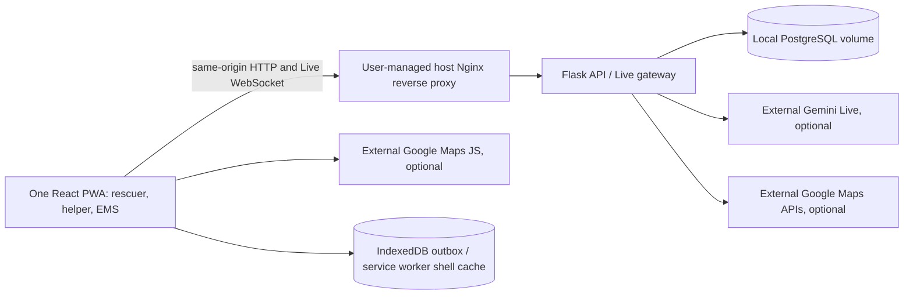
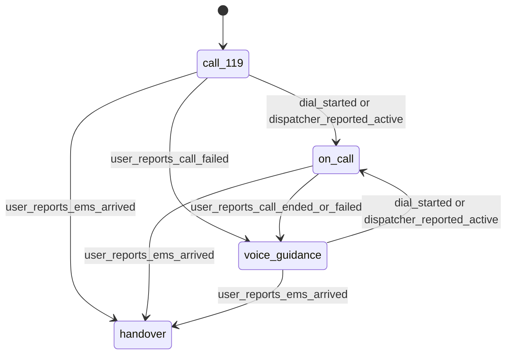

# First Aid Copilot — Software Design Document

Status: local deployment baseline with a partially implemented React / Vite frontend and Flask API. The backend now exposes pinned-rule evaluation, normalized PostgreSQL snapshots/MIST, and AED dispatch/reassignment; clinical review, browser feature wiring, and offline PWA behavior remain incomplete. For callable backend behavior, use [the integration guide](../agent/INTEGRATION.md) and checked [OpenAPI](../agent/openapi.json).

Product name: 急救副駕 (First Aid Copilot). Primary interface language: Traditional Chinese (`zh-TW`). Operating context: Taiwan and emergency number 119. Repository collaboration rules are in [AGENTS.md](../AGENTS.md).

> This is an emergency assistance prototype. Its medical decision-making has not been clinically validated. Direct users to contact 119 first and follow the dispatcher's instructions whenever dispatcher guidance is available.

## 1. Product Definition and Scope

**The dispatcher leads; the Agent assists.** The product supports reporting, scene records, AED retrieval, and handoff. During dispatcher guidance, it stays silent and presents a reporting cheat sheet, quick-event buttons, a scene snapshot, and helper progress. When a user reports that dispatcher guidance ended or a call could not connect, rule-based voice guidance becomes available.

All participant interfaces are planned in one React browser application; there is no native mobile app. The current frontend has synthetic guidance content, an IndexedDB event outbox, and a prepared-shell service worker; installable-PWA metadata and complete offline product wiring are not implemented yet. The TypeScript clinical-rule interpreter exists and passes shared fixtures. PWA installation will be optional. The prototype handles one patient per incident and one primary rescuer browser session, with additional helper and read-only handoff sessions. Patient populations, exclusions, and clinical eligibility must be declared in the reviewed rule package.

| ID | Capability | Required behavior |
| --- | --- | --- |
| F01 | Dial-first entry | The first screen provides a large 119 link, a one-line scene-safety reminder, speakerphone instructions, and a suggestion to designate another caller. No assessment, permission, registration, or model initialization blocks the link. |
| F02 | Conditional voice | Online speech interaction is enabled only in voice-guidance mode with explicit user activation. Buttons remain available throughout the flow. |
| F03 | Reviewed guidance | Support assessment, CPR, bleeding-control, and recovery-position flows defined by reviewed rules and fixed instruction templates. |
| F04 | Foreground timing | Provide a local visual CPR beat, optional audio outside call mode, and applicable two-minute reminders without relying on model timing. |
| F05 | Optional scene capture | Selected camera frames can propose snapshot fields, with user confirmation and visible uncertainty. Camera access is optional. |
| F06 | Helper coordination | QR links open an AED-runner or ambulance-greeter task without installation. The greeter can read the same scene snapshot as EMS. |
| F07 | AED retrieval | Search candidates, show walking routes, track foreground helper updates and estimated return time, and reassign an unavailable AED. |
| F08 | Event history | Record user reports, rule decisions, command results, helper updates, corrections, and timestamps as distinct events. |
| F09 | Handoff | Display the scene snapshot first, then MIST and the complete timeline. The primary session can show its local record when the hosted viewer cannot connect. |
| F10 | Lightweight offline operation | After required resources have been cached, retain approved text, button-driven TypeScript rules, a local snapshot, an event outbox, and cached government AED records. |
| F11 | Recovery and synchronization | Restore available local records and reconcile reconnects without duplicate actions, stale speech, or reverting the current interaction mode. |
| F12 | Scoped temporary access | Restrict participant access by incident and task, expire sharing grants, and apply data retention to server and local records. |
| F13 | Manual call mode | Clicking the call link or reporting an external call immediately mutes the Agent. Users explicitly report call end or failure before voice can resume. |
| F14 | Reporting cheat sheet | Present location, circumstances, patient condition, and performed actions in large readable text, preserving unknown values. |
| F15 | Shared scene snapshot | Maintain location / access details, circumstances, patient condition, performed actions, people present, and hazards with provenance and freshness. |
| F16 | Quick-event controls | Persist one-tap reports such as `CPR started`, `Someone is fetching an AED`, and `EMS arrived`, with correction support. |

The core demonstration is silent call support, inaccessible-AED reassignment, and snapshot-first handoff, with voice and offline variants. Automatic telephone-state detection, automatic speakerphone control, guaranteed background execution, downloaded language models, diagnosis, medication recommendations, automated dispatch, and multi-patient triage are outside scope.

## 2. System Architecture




The baseline media path is browser → Flask Live WebSocket gateway → ADK → Gemini Live API. Structured application operations use RESTful JSON over HTTPS. Long-lived credentials stay on the backend. PostgreSQL carries structured state, not raw Live media. The user-managed Nginx is the browser entry point; it runs outside this repository’s Compose stack. The backend is one application with internal modules; Redis is not required for the current prototype.

The current Live gateway accepts authenticated PCM audio and emits allowlisted, unconfirmed observation proposals. The browser presents each proposal for an explicit yes, no, or unknown answer, persists the human answer as a confirmed user report, and then requests a pinned rule evaluation. It does not stream Agent speech or improvised clinical instructions; the UI renders fixed template text returned by the rule service and labels unreviewed content. Optional external model operations use Google Gemini. Optional image extraction can run separately from the Live voice session, allowing structured call-mode work to continue with no microphone upload or spoken response. Model IDs are configuration and must be verified against the selected session's language, modality, and tool requirements. [Gemini Live API](https://ai.google.dev/gemini-api/docs/live-api)

| Component | Authority |
| --- | --- |
| React feature routes | Present information, collect explicit user reports, and request authorized operations. |
| Browser mode controller | Select the interaction mode from UI events and enforce the local audio / microphone gate immediately. |
| Browser runtime | Execute permitted commands, schedule foreground output, persist local records, and evaluate rules offline. |
| Gemini | Propose structured observations and bounded conversational responses. It cannot select clinical transitions or authorize treatment. |
| Rule interpreters | Produce deterministic state transitions, template references, action intents, and timer changes. |
| Backend services | Enforce identity and revisions, persist events, project snapshots, and coordinate helpers and AED retrieval. |

Only the primary session executes guidance. Online decisions are committed by the backend; offline decisions use the same pinned rule package in TypeScript. The browser's current mode and playback gate are always checked before any output, regardless of server state.

## 3. Technology and Frameworks

| Layer | Selected technology | Purpose |
| --- | --- | --- |
| All participant interfaces | React, TypeScript, Vite, React Router | One mobile-first application, shared types / components, and separate participant routes. |
| Browser media | `getUserMedia`, Web Audio API, AudioWorklet where needed | Permission-based microphone / camera access and local playback / audio processing. |
| Browser interaction state | Shared TypeScript controller exposed through React context / hooks | Mode changes, audio gating, clinical-state presentation, and explicit user controls. |
| Local persistence | IndexedDB behind a shared repository | Incident state, event outbox, command results, rule metadata, and AED records. |
| PWA assets | Web app manifest, service worker, Cache Storage | Optional installation and caching of the application shell and approved public assets. |
| Browser transport | `fetch`, WebSocket | RESTful JSON mutations, Live media / control transport, and scoped snapshot reads. |
| Backend | Python 3.12, Flask, Pydantic, Google ADK, Google Gen AI SDK | RESTful API validation, Live sessions, tool orchestration, and application services. |
| Rules | Restricted YAML, JSON Schema, Python and TypeScript interpreters | Shared definitions and deterministic online / offline behavior. |
| Mapping and location | Geolocation API, Maps JavaScript API, Routes API, Geocoding API | Foreground location reports, map display, walking estimates, and candidate addresses. |
| Data and identity | PostgreSQL, opaque local sessions | Incident storage, scoped sessions, access grants, and projection updates. |
| Deployment | Docker Compose, user-managed Nginx, Docker volumes | API and database containers; external reverse proxy and frontend static files. |
| AED ingestion | Python ETL | Normalize and version the selected government dataset. |
| Verification | Vitest, Playwright, pytest, local PostgreSQL integration tests | Browser behavior, rule parity, service contracts, access rules, and scenarios. |

There is one frontend manifest, lockfile, and router. Feature components use shared media, transport, and storage adapters. Do not create separate applications for the rescuer and helpers. Exact dependencies and versions will be pinned in the implementation manifests.

The supported demonstration uses tested mobile-browser profiles over HTTPS with the relevant pages visible. Record the browser / device versions used in verification; installation alone does not expand browser capabilities. [PWA overview](https://developer.mozilla.org/en-US/docs/Web/Progressive_web_apps)

## 4. Routes and User Experience

Sections 4–8 specify target product behavior unless a current implementation is explicitly identified. The frontend now calls Flask for local identity, incidents, events, observations, shares, helper updates, AED availability, and handoff timelines. Narrative rescue fields and clinical guidance remain synthetic.

### 4.1 Rescuer Routes

The current `/` route is a demo entry screen, and `/incidents/:incidentId` is a planned active-incident route. The target UI first shows a large telephone link, one-line scene-safety reminder, speakerphone instructions, and a suggestion to designate another caller. The hackathon prototype uses the configured test link `tel:0979796806` and must not dial 119. Dial access does not wait for persistent storage, authentication, GPS, or a model session.

Before handing control to the telephone link, the browser synchronously closes its audio gate and queues `call.reported` with `reportedState: attempted`. The system decides how a telephone link is handled; record only the attempted launch, not a successful connection or enabled speakerphone. `on_call` begins only after the user confirms that the dispatcher is connected; a reported failure enters or continues voice guidance. The caller enables speakerphone in the system interface and returns to the PWA for the cheat sheet when practical. [Telephone links](https://developer.mozilla.org/en-US/docs/Web/HTML/Reference/Elements/a#linking_to_telephone_numbers)

Call mode presents the cheat sheet, quick buttons, helper progress, and a visual beat when applicable. Voice-guidance mode presents one approved instruction with large `Yes`, `No`, `Unsure`, repeat, correction, and stop-speaking controls. Manual controls report `Dispatcher is on the line`, `Someone else is calling`, `Call ended`, and `Could not connect`. The interface does not imply it can observe the real telephone call.

### 4.2 Reporting Cheat Sheet and Scene Snapshot

The cheat sheet is a large-type view of the shared scene snapshot. Its order is location, circumstances, patient condition, and performed actions, followed by people present and hazards. Wording and ordering require review by dispatch or rescue professionals.

| Field | Content |
| --- | --- |
| Location | Coordinates, accuracy, address, landmark, floor, entrance, access notes, and capture time. |
| Circumstances | What happened and the reported occurrence time; unknown if not witnessed. |
| Patient condition | Structured observations with source, confirmation / uncertainty labels, and last-observed time. |
| Performed actions | Reported actions and their times, kept separate from recommendations and issued commands. |
| People present | Reported patient and bystander counts plus helper-task summaries; additional patients are outside the single-patient flow. |
| Hazards | Reported or camera-proposed traffic, fire, standing-water, and crowd-obstruction risks, with an empty field treated as unknown. |

In the target scene projection, each field retains its value, source, confirmation state, observation time, and evidence references. Reverse geocoding proposes an address; users confirm or enter landmarks, floor, and access information. Model or camera output cannot silently replace a confirmed fact. The planned deterministic projector produces `snapshotRevision`, `updatedAt`, and the source-event boundary; today `GET snapshot` returns only typed observations and revisions. [Google reverse geocoding](https://developers.google.com/maps/documentation/geocoding/guides-v3/requests-reverse-geocoding)

Quick buttons persist reports before upload and update the local projection immediately. A reported AED runner departure does not prove a QR task was accepted. Corrections append a reference to the original event and distinguish entry time from any user-entered occurrence time. Failed local persistence must be visible rather than acknowledged as a saved record.

### 4.3 Helper and Handoff Routes

The `/join/:inviteId` route exchanges a QR invitation for an authenticated grant, then opens `/incidents/:incidentId/helpers/:helperId` or `/incidents/:incidentId/handoff`. The invitation secret travels in the URL fragment, is sent to the exchange endpoint, and is removed from browser history before third-party map resources load. A non-secret `scope` query controls only pre-exchange wording; the server grant controls post-exchange access and routing. The link contains no clinical data.

An AED runner sees its task, destination, access notes, map / walking route, and return location. It can report arrival, inability to obtain the AED, collection, and delivery. Location permission is requested only for the task; manual status reporting works without it. Tracking is expected only while the helper page is visible, and stale updates are explicitly labeled.

The ambulance greeter sees its meeting task and the same scene-snapshot document as EMS. The handoff page shows that snapshot first, then MIST and a paginated full timeline. MIST represents mechanism / medical complaint, injuries, signs, and treatment. Unknown fields remain unknown, and a recommended action is never displayed as completed treatment.

A hosted QR viewer requires connectivity and a valid grant. Offline handoff uses the primary session's locally stored view shown directly on screen. Scanning or viewing a QR code does not mark the incident handed over.

## 5. Interaction Modes and Output Policy



The backend validates these mode transitions, and the rescuer controls report them through the IndexedDB outbox while enforcing the local media gate immediately. Transitions into `voice_guidance` require the user to report that no dispatcher remains guiding the scene, including calls on another person's phone. A local idle browser, a visible tab, microphone silence, or a network timeout cannot establish that condition.

| Mode | Permitted behavior |
| --- | --- |
| `call_119` | Silent entry screen, emergency access, and local incident preparation without a blocking questionnaire. |
| `on_call` | No Agent speech, microphone upload, spoken reminders, or metronome sound. Quick records, snapshots, helper coordination, and foreground visual timing remain available. |
| `voice_guidance` | Approved spoken / text guidance, permitted online voice interaction, optional audible metronome, and rule-defined reassessment. |
| `handover` | Silent snapshot-first record and QR display. Guidance does not restart when call or connection events arrive. |

`interactionMode`, `clinicalState`, `connectionMode` (`online`, `offline`, `resyncing`), `guidancePaused`, and incident `status` (`active`, `handed_over`, `closed`) are separate fields. Mode changes retain treatment history and elapsed time; stale clinical observations require the rule-defined clarification or reassessment.

Each mode or pause-policy change increments `modeRevision` locally before server synchronization and invalidates queued output from the previous revision. Entering call mode cancels current playback, flushes queued speech, stops Agent microphone capture, and disables audio timing. Delayed frames and commands from another mode revision are discarded. Reconnection never overrides the local mode.

During voice guidance, local speech activity is treated as barge-in: queued and active Agent playback is stopped immediately while the microphone sample continues through the permitted Live path. This local interruption does not change interaction mode. Every inbound Live message carrying a `modeRevision`, including session and output messages, is discarded unless it matches the current local revision.

When the page becomes hidden, set `guidancePaused`, stop media capture and playback, persist available state, and mark visual timing / local tracking suspended. Visibility changes do not change reported call status. On return, refresh data, display any interruption, and require an explicit user action before restarting voice. Browsers may suspend animations and throttle background timers. [Page visibility and background limits](https://developer.mozilla.org/en-US/docs/Web/API/Page_Visibility_API)

Backend helper services can process reports from other connected participants while the primary tab is suspended. The primary UI catches up when resumed; it must not claim its own browser continued running throughout the interruption.

## 6. Shared Rules and Model Boundaries

### 6.1 Rule Package

The `rules/` package contains versioned schemas, the `demo-v1` flow and templates, and shared fixtures. `ClinicalRuleService` runs the Python interpreter and pins the loaded content by rule version and hash. The TypeScript interpreter in `web/src/lib/rules/` validates the same schemas and runs the same fixture index for deterministic offline evaluation. Each incident pins one package version; its IndexedDB bundle retains the content hash and refuses different content under that version. Normal operation accepts only `reviewed` packages; the existing `unreviewed_demo` package is available only through `?demo=1` and must not be presented as approved guidance.

The rule language supports named states, required observations, ordered transitions, explicit unmatched-input behavior, allowlisted actions, template parameters, timer lifecycle events, and interaction-mode interrupts. Conditions are limited to declared comparisons and `all`, `any`, and `not`. Missing observations become `unknown`, never `false`.

Python and TypeScript use the same normalization and evaluation order. Loaders reject duplicate YAML keys, implicit type ambiguities, unsupported operators, dangling transitions, missing templates, and arbitrary executable expressions. Shared fixtures verify identical state, instruction, action, and timer results in both runtimes.

Clinical families include assessment, CPR, bleeding control, recovery-position guidance, AED support, and reassessment. The requested CPR reminder interval is 120 seconds where the reviewed flow enables it. Eligibility, wording, exception handling, and uncertainty rules belong to the reviewed package; a reminder never automatically stops treatment or invents a new clinical decision.

### 6.2 Observation and Decision Contracts

An observation includes `observationId`, allowlisted `key`, typed `value`, `source`, `observedAt`, `receivedAt`, `confirmation`, and `evidenceEventIds`. Boolean observations use `true`, `false`, or `"unknown"`. Sources distinguish voice reports, buttons, camera proposals, and other explicitly supported inputs. Camera analysis uses `hazards.traffic`, `hazards.fire`, `hazards.standingWater`, `hazards.crowd`, and `patient.bleeding`; the rule adapter maps the last field to `bleeding_severity`. A model proposal cannot confirm itself, and a camera frame alone cannot establish a safe scene or normal breathing.

A `Decision` includes the pinned rule version, accepted observation IDs, source / target clinical state, `reasonCode`, optional approved template ID and parameters, allowed action intents, timer changes, and expected state / mode revisions. Interpreters are pure evaluators; adapters perform external actions only after authorization and revision checks.

The backend commits online decisions before issuing commands. Offline decisions and resulting reports are recorded locally. Commands have stable IDs, an authority epoch, state / mode revisions, and expiry. The client records `received`, `started`, `completed`, `failed`, or `interrupted` results. Idempotent desired-state operations prevent duplicate metronome starts; an uncertain external outcome is reconciled rather than blindly repeated.

Critical instructions are fixed reviewed text, spoken through packaged recordings or an available browser speech voice. Online conversational audio may clarify input or report coordination status only when the local gate permits it. It must not carry unconstrained treatment advice; clinical follow-up answers resolve to approved templates. A model prompt alone is not the enforcement boundary.

## 7. Browser Media, Timing, and Offline Runtime

### 7.1 Media and Foreground Timing

Microphone and camera access use `getUserMedia` over HTTPS with permission. Audio adapters convert captured samples to the selected Live session format; do not assume compressed `MediaRecorder` output can be forwarded as raw PCM. Camera analysis is deliberately not a Live interaction: the user opens the rear camera, captures one resized JPEG, and reviews five typed proposals after the camera stops. The API accepts at most 700 KB, rejects a stale `modeRevision`, does not persist the raw frame, and requires human confirmation before observations enter the canonical snapshot. Denied camera access or unavailable image analysis leaves manual reporting usable. Calls are not recorded or transcribed by the Agent. [Browser media capture](https://developer.mozilla.org/en-US/docs/Web/API/MediaDevices/getUserMedia)

Create or resume Web Audio playback from a user gesture and provide a visible enable-audio control when playback is blocked. The shared audio controller owns model playback, template speech, and metronome output, and cancels all of them when mode or pause state prohibits audio. Missing speech voices fall back to approved text or already cached recordings. [Web Audio practices](https://developer.mozilla.org/en-US/docs/Web/API/Web_Audio_API/Best_practices)

The metronome is generated in the browser, never streamed from the model. Use the audio clock for permitted sound and elapsed-time-based scheduling for visual beats, rather than counting React renders. Store timer definitions and treatment start events; use a monotonic clock during an active page lifetime. Audio is muted in call mode. Timers due while hidden or muted do not produce a burst of reminders on return.

Reloads create a new page clock. Restore history, show the interruption, and reconcile time and current observations before resuming applicable reminders. System clock changes must be treated as uncertainty. An optional screen wake lock can reduce accidental screen sleep on supported visible pages, but can be denied or released and does not guarantee background execution. [Screen Wake Lock API](https://developer.mozilla.org/en-US/docs/Web/API/Screen_Wake_Lock_API)

### 7.2 PWA Cache and Local Storage

The current service worker caches only the prepared public app shell and explicitly approved static assets. It does not cache authenticated API responses, invitation secrets, clinical pages as HTML snapshots, raw media, or map tiles. Versioned rule bundles, approved recordings, and AED-cache assets remain future additions. Private records belong in the primary session's controlled IndexedDB store, not a shared HTTP cache.

Offline readiness requires a completed prior load of the necessary assets and rule version. A first-ever visit without connectivity cannot load an uncached website. Optional installation is not a prerequisite for use and is not proof that all offline resources are ready. Show explicit readiness and missing-resource states. [PWA offline operation](https://developer.mozilla.org/en-US/docs/Web/Progressive_web_apps/Guides/Offline_and_background_operation)

The current IndexedDB store contains incident state, an ordered event outbox, command acknowledgements, and rule-bundle slots. Snapshot projections and AED cache records remain future additions. The target store includes:

- Local incident state, interaction mode, pinned rule metadata, and scene-snapshot projection.
- An ordered outbox of observations, quick records, mode changes, corrections, and command results.
- Command deduplication / acknowledgement records and timer restoration data.
- Versioned government AED records with source freshness and local expiry.

Write related state and outbox entries in a transaction before acknowledging a saved report. Quota or storage failures display a recording-degraded state; emergency access and available guidance remain usable. Browser storage can be cleared or evicted, so unsynchronized records must not be described as permanently retained. A persistence request may help where available, without guaranteeing recovery. [Browser storage limits](https://developer.mozilla.org/en-US/docs/Web/API/Storage_API/Storage_quotas_and_eviction_criteria)

Do not force a waiting service worker to replace an active incident's app / rule versions. Activate an update when no incident is active or after an explicit reload with safely stored state. A compatible existing rule bundle must remain available until its incidents finish.

### 7.3 Capability Degradation

| Unavailable capability | Behavior |
| --- | --- |
| Gemini / network voice | Use large buttons and the local rule interpreter with fixed text / cached prompts. No language-model download is required. |
| Microphone or camera | Continue manual observations and quick records without blocking the incident. |
| Speech output | Show the approved text and any available cached recording; obey the audio gate regardless of voice availability. |
| Server data or authentication | Keep local records and cached rules; show remote helper data as stale. New shared sessions require connectivity. |
| Routing / maps | Show cached AED addresses, access notes, age, and straight-line distance where coordinates are available. Do not fabricate walking directions or an ETA. |
| Local persistence | Clearly identify unsaved records and limited recovery. Do not block the telephone link waiting for a write. |
| Cached shell or rule bundle | Explain the missing offline capability; do not substitute generated clinical advice. |
| Visible page | Suspend browser media / visual timing and local tracking; reconcile on return without inferring that a telephone call ended. |

### 7.4 Synchronization and One Primary Session

Assign a random installation-scoped `clientId` in browser storage and a tab-scoped `clientInstanceId`; neither is a hardware identifier. Events have stable UUIDs, `clientSequence`, `clientTime`, rule version, mode revision, and authority epoch. The authenticated server assigns identity and receipt time and deduplicates by event ID.

Only one tab may execute guidance for an incident. On the supported browser profile, use an origin-scoped Web Lock for that incident; another tab displays a read-only / already-open state. Across browser profiles, backend ownership and revision checks reject a second primary writer. If reliable local arbitration is unavailable, do not claim safe multi-tab offline operation; limit that profile to an explicitly controlled single-session demo. [Web Locks API](https://developer.mozilla.org/en-US/docs/Web/API/Web_Locks_API)

The target offline runtime will preserve the current interaction mode, queue ordered events, and reconcile the outbox after reconnect. The current backend accepts bounded event batches with exact revision and authority-epoch checks; it does not merge a divergent offline branch or advance an authority epoch on its own. A conflict must remain visible to the client rather than being treated as a successful merge.

Historical replay updates records and projections without re-executing treatment prompts, completed commands, or helper dispatches. Conflicting ownership, unsupported rule versions, or an unreconcilable branch keep the client in local mode with a visible conflict. Server receipt time does not reorder offline occurrences, and the latest local call mode cannot be overwritten by a stale server state.

The user-facing scene snapshot is distinct from the full incident-state snapshot used for recovery. Accepted events rebuild its projection and revision. The browser remains responsible for marking unsynchronized local facts until the shared revision catches up.

## 8. AED Data and Coordination

The Python ETL supports the Ministry of Health and Welfare national AED CSV listed by the Taiwan Government Data Open Platform. It validates coordinates, deduplicates AED IDs, retains source location IDs, and preserves names, addresses, weekday / weekend opening hours, access notes, source URL, update / ingestion times, dataset version, checksum, and license metadata. The official CSV is downloaded only into an ignored versioned local cache and is not committed. Missing day groups remain unknown, and the atomic cache pointer retains the last valid dataset after a failed download or import. See [`data/aed/README.md`](../data/aed/README.md) for the update command and source details.

The backend AED services implement geographic candidate filtering with exact-distance checks, access / availability checks, walking-route estimates, and incident-scoped exclusions. The normalized PostgreSQL catalog repositories and official cache loader are composed into the Flask API. PostgreSQL does not supply the AED dataset automatically. Government records may be cached locally; offline Google map tiles or route-result caching are not assumed.

The backend retrieval estimate includes runner → AED and AED → patient, with any retrieval-time assumption represented separately. After collection, it estimates the remaining runner → patient journey. The API returns route-source and uncertainty fields; the UI still needs to render the estimate, age, location accuracy, and provider source. Maps JavaScript displays the map; Routes API calculates route data through the provider adapter. An external navigation link may be offered, with a reminder that leaving the PWA can interrupt tracking. [Routes API](https://developers.google.com/maps/documentation/routes/compute_route_directions)

The domain assignment service uses `offered`, `accepted`, `en_route`, `arrived`, `collected`, `returning`, and `delivered`, plus `unavailable`, `cancelled`, or `expired`. The current update API accepts only `accepted`, `en_route`, `arrived`, `obtained`, and `unavailable`; it checks the assigned helper and `assignmentRevision` but does not call the assignment service.

The unavailable-AED domain flow records a reason, invalidates the old assignment, excludes that candidate for the incident, and selects the next viable destination with revision checks. The normalized repositories persist assignments, exclusions, and reports. The dedicated Flask unavailable-report endpoint calls the transactional assignment service to exclude and reassign. The generic helper `unavailable` status remains a separate event and does not trigger reassignment. The helper must acknowledge the updated destination. Repeated reports cannot duplicate assignments; if no candidate remains, report that no accessible candidate is known rather than recycling failed locations.

Helper tracking and reassignment remain independent of the Live session; the dedicated unavailable-report API invokes the Workstream 5 assignment service. Updates remain visual in call mode. Helpers with visible connected pages can continue reporting while the primary page is offline or hidden; the primary must show those values as stale until it actually receives them.

## 9. RESTful API, Live Events, and Tools

Structured mutations pass through Flask RESTful JSON endpoints with authenticated identity, schema validation, incident scope, revisions, and idempotency. The dedicated WebSocket is only for mode-permitted Live media and control messages; it is not the general data API. Scoped REST reads provide the current canonical snapshot; clients can poll while a dedicated data subscription is absent. `agent/app/schemas/` and a checked OpenAPI specification define HTTP contracts; shared frontend types live in `web/src/types/`.

| Interface | Contract |
| --- | --- |
| `POST /v1/sessions` | Create an expiring opaque local session before authorized API writes. |
| `POST /v1/incidents` | Idempotently register a locally generated incident UUID for the authenticated primary client. |
| `WS /v1/incidents/{id}/live` | Authenticate before accepting media; return current revisions with voice disabled on every connection. The client reconciles REST events before an explicit resume. |
| `POST /v1/incidents/{id}/event-batches` | Accept bounded ordered event batches online or after an outage; return acknowledgements, conflicts, and current revisions. |
| `POST /v1/incidents/{id}/scene-observations` | Store typed observations with evidence and expected snapshot revision; project canonical scene sections and actions in the same transaction. |
| `POST /v1/incidents/{id}/scene-image-analyses` | Analyze one authenticated JPEG/WebP frame into five unconfirmed, allowlisted proposals; requires the current mode revision and never stores the image. |
| `POST /v1/incidents/{id}/location-descriptions` | Validate authorized coordinates; currently returns `503 unavailable` because geocoding is not connected. |
| `POST /v1/incidents/{id}/shares` | Create an expiring, participant-scoped invitation. |
| `POST /v1/incidents/{id}/access-revocations` | Revoke the incident’s pending invitations and active grants with an expected revision. |
| `POST /v1/share-sessions` | Bind a valid invitation to the invitee’s existing local session and create a scoped grant. |
| `POST /v1/incidents/{id}/helpers/{helperId}/updates` | Accept only the authorized helper's own location / task reports with the current assignment revision. |
| `GET /v1/incidents/{id}/aeds` | Search the imported AED catalog around reported coordinates; returns no candidates until a dataset is imported. |
| `GET /v1/incidents/{id}/snapshot` | Return canonical sections, actions, and provenance-bearing observations to primary, greeter, or EMS. |
| `GET /v1/incidents/{id}/handoff/events` | Return a cursor-paginated, field-filtered timeline to an authorized primary or EMS session. |
| `GET /v1/incidents/{id}/handoff` | Return canonical snapshot, MIST, and timeline page to primary or EMS. |
| `POST /v1/incidents/{id}/rule-evaluations` | Preview a pinned Python rule decision at exact state and mode revisions; demo content requires an explicit unreviewed-content flag. |
| `POST /v1/incidents/{id}/aed-assignments` | Dispatch to a granted AED runner using the imported catalog and reported patient location. |
| `POST /v1/incidents/{id}/helpers/{helperId}/aed-unavailability-reports` | Authorize the assigned runner and return a revised AED destination or explicit no-candidate result. |
| `PATCH /v1/incidents/{id}` | Change incident status with an expected revision. Closing revokes pending invitations and active grants and blocks primary mutations. |

These resource-oriented paths replace the earlier `events:sync`, `location:describe`, `share-sessions:exchange`, and `close` action paths. The frontend uses a shared same-origin client and an IndexedDB outbox; feature screens do not own transports. Local mode recovery and acknowledgement-based upload are implemented; divergent conflict merging remains unimplemented and is exposed as `resyncing`. Workstream 1 owns the Flask routes and contract; workstream 3 updates the shared browser client and offline sync; workstreams 2 and 4 consume the incident, helper, share, AED, and handoff operations; workstream 5 supplies the underlying data services. Existing identifiers, revision checks, error codes, and access rules remain required. For example, a client uploads a synthetic report with `POST /v1/incidents/{id}/event-batches`:

```json
{
  "events": [
    {
      "eventId": "4b7a9f79-b3b4-4a60-91cb-b958d570f3ef",
      "type": "action.reported",
      "detail": {"action": "cpr_started"},
      "clientId": "9200c811-3521-4a66-a037-9bd0bb4dc698",
      "clientInstanceId": "2bc8a203-21cc-4d95-9a0a-ef22ee924679",
      "clientSequence": 7,
      "clientTime": "2026-09-19T00:00:00Z",
      "authorityEpoch": 1,
      "stateRevision": 3,
      "modeRevision": 2,
      "ruleVersion": "demo-v1"
    }
  ]
}
```

The control envelope includes `protocolVersion`, `messageId`, `incidentId`, `clientId`, `clientInstanceId`, `clientSequence`, `clientTime`, `authorityEpoch`, `stateRevision`, `modeRevision`, and typed `payload`. The server derives `actorId` from the authenticated session. Media frames add session, sequence, mode revision, and content type. The current gateway accepts bounded PCM audio; JPEG frames return `unavailable`.

The current `EventInput` schema accepts `mode.changed`, `call.reported`, `action.reported`, `event.corrected`, `observation.proposed`, `observation.confirmed`, `command.acknowledged`, `timer.elapsed`, and `helper.updated`. `decision.committed`, `command.issued`, `incident_state.updated`, and `scene_snapshot.updated` are planned events and are rejected today. Mode events are user / browser-controller reports, not verified telephone telemetry. Snapshot updates include the revision and source-event boundary.

| Planned Agent tool | Target server behavior |
| --- | --- |
| `get_next_step(observations, expectedRevision)` | Evaluate validated observations with the pinned rules and current mode; reject stale revisions. |
| `log_event(type, detail, idempotencyKey)` | Validate an allowlisted event schema and source; do not manufacture confirmed treatment. |
| `find_nearest_aeds(lat, lng, k)` | Perform bounded geographic filtering and route / availability lookup. |
| `dispatch_helper(role)` | Create or reuse a scoped task without duplicate assignments. |
| `get_helper_status()` | Return status, freshness, and estimate provenance for the authorized incident. |
| `analyze_scene(image)` | Propose typed snapshot observations; image content cannot override instructions or issue actions. |
| `update_scene_snapshot(observations, expectedSnapshotRevision)` | Project accepted events while preserving confirmation and uncertainty. |

The model-tool table is target behavior; structured REST endpoints expose rule evaluation and AED reassignment, while unimplemented model tools fail closed with `unavailable`. Dial-link activation, mode changes, quick-event buttons, audio gating, and metronome controls are browser actions. They do not wait for a model tool call. A model cannot place a call, claim it connected, or bypass the local gate. Expected API errors include `unauthorized`, `expired`, `stale_revision`, `rule_mismatch`, `unavailable`, and `invalid_input`, mapped to short user-facing messages.

## 10. Persistence and Permissions

### 10.1 PostgreSQL layout and current limits

The active API stores opaque session token hashes in `local_sessions` and
normalized incident records in PostgreSQL. The older `app_state` JSONB adapter
remains selectable only for temporary compatibility with existing prototype
data; its invitation retry copies use `LOCAL_INVITE_KEY` encryption.

Flask now selects the normalized PostgreSQL repositories by default when
`DATABASE_URL` is set. A `PostgresUnitOfWork` binds event ingestion, incident
revision update, and scene-snapshot projection to one transaction. The
`INCIDENT_BACKEND=legacy` setting selects the older JSONB adapter temporarily;
existing JSONB incidents are not automatically migrated to normalized rows.

The normalized schema stores incidents, append-only events, scene projections,
invitation hashes, grants, versioned AED datasets, assignments, exclusions,
unavailable-AED reports, and API idempotency responses. `GET /snapshot` shares
one canonical projection with primary, greeter, and EMS. `GET /handoff` returns
that snapshot above evidence-backed MIST and the filtered timeline. A runner
cannot read clinical data. AED data must be imported; no records are seeded or
invented. Without a route provider, estimates are explicitly marked as
straight-line fallback, not walking directions or ETA. Geocoding remains
`503 unavailable`.

Pinned Python rules are callable through `/rule-evaluations`. The included
`demo-v1` package is `unreviewed_demo` and is disabled at the API boundary
unless `ENABLE_UNREVIEWED_DEMO_RULES=1` is set for synthetic training. Clinical review and complete browser integration remain required before
clinical guidance can be presented as approved. Compose runs forward-only migrations
before API startup and hourly retention cleanup; authorization enforces expiry
immediately, independently of physical deletion.

### 10.2 Identity and Access

The primary PWA can create an opaque local session with `POST /v1/sessions` when online and uses a local random client identity before registration succeeds. Locally created events may be uploaded only after authenticated ownership is established. A browser refresh cannot silently bind a stored incident to a different account.

QR invitations contain high-entropy secrets; lookups use hashes and retry copies are encrypted. Exchange checks expiry, redemption, and scope, then binds a scoped grant to the invitee’s independently created local session. Authentication lifetime and incident-grant lifetime are separate; a valid token alone does not grant access to every incident. Session-scoped authentication supports viewer refresh without making clinical records a persistent shared-browser cache.

| Actor | Allowed access |
| --- | --- |
| Primary session | Its incident, scene snapshot, observations / records, mode controls, and sharing operations. |
| AED runner | Its own task / location and AED-unavailability endpoints, plus AED candidates from an imported dataset. Workstream 4 must render the new assignment response. No clinical snapshot, MIST, or complete timeline. |
| Ambulance greeter | Shared observation snapshot and its own task / location update endpoint; meeting-task view and condition / action summaries are planned. No full clinical timeline or other helpers' location histories. |
| EMS viewer | Shared observation snapshot and sanitized timeline until expiry. The API exposes canonical MIST; Workstream 4 must render it. No mutation permission. |
| Backend process | Validated canonical writes and projections through PostgreSQL credentials kept inside the API container. |

The browser has no direct PostgreSQL access. Flask validates session token hashes, incident ownership, grant scope, and expiry for each API read or write. An incident ID is not permission, and readable response bodies must not contain fields that their viewers should not see.

## 11. Deployment, Privacy, and Failure Handling

Docker Compose starts `web` (a multi-stage Vite build served by a lightweight Node HTTP server with SPA fallback), `api` (Flask / Gunicorn), `db` (PostgreSQL with a named volume), one-shot `migrate`, and hourly `retention`. It does not run Nginx. Web and API publish only on host loopback at configurable `WEB_PORT` and `API_PORT`; PostgreSQL has no host port. User-managed host Nginx on ports 80/443 sends ordinary pages to the web port and sends `/v1/` plus `/healthz` to the API port without rewriting paths, preserving WebSocket Upgrade for Live. Run `./scripts/setup-local.sh`, then `docker compose up --build -d`; `node scripts/smoke-local.mjs` verifies the direct local stack. `PUBLIC_ORIGIN` must match the browser origin for Live WebSocket checks. A phone connecting over a LAN needs trusted HTTPS at the user-managed Nginx before browser microphone or camera access is available.

Never place long-lived Gemini credentials or private session/invitation keys in `VITE_*` variables; browser map keys must be origin- and API-restricted. A Docker deployment is local even though Gemini Live and Google Maps remain external services when enabled.

Incident state lives in PostgreSQL, not only in an ADK session or in-memory coroutine. A reconnect receives `voiceAllowed:false` and must resynchronize before the user explicitly resumes guidance. No automatic speech resume occurs.

Configuration includes model IDs, rule package versions, permitted origins, supported browser capabilities, reminder intervals, dataset / region selection, stale-data thresholds, media limits, share / grant lifetimes, and retention periods. Pin the current bundle for active incidents and keep secrets server-side.

Do not request patient names, identity numbers, or contact details. Location and medical observations remain sensitive. Raw audio, frames, and full transcripts are not retained by default; logs exclude clinical payloads, precise coordinates, and credentials. Provider data handling must be verified before claiming any retention guarantee.

Sessions, grants, and incidents have expiry checks at authorization time. A new
session deletes expired session rows; a later successful incident operation
purges incidents older than 72 hours and expired grants/invites. Deployments can
invoke `python -m app.services.postgres_data cleanup` from cron or a host timer
to clean idle databases; the repository does not add another scheduler service.
Local stores are purged on open / resume and closure according to their
retention rules; a closed browser cannot guarantee deletion at an exact
wall-clock instant.

Helper / EMS pages keep clinical view state in memory and clear it on grant expiry or sign-out. Revocation stops future access but cannot erase information already seen. Incident closure stops media / location capture, cancels active operations, and retains only what the configured handoff and retention policies allow.

| Failure | Required behavior |
| --- | --- |
| Call state uncertain | Stay silent until the user explicitly reports dispatcher availability; never infer it from browser visibility or connectivity. |
| Backend / Live API unavailable | Continue permitted local rules and records; show remote values as stale and keep the current mode. |
| Storage unavailable or evicted | Identify missing / unsaved history, retain accessible emergency controls, and avoid fabricated recovery. |
| Camera / location / audio denied | Offer manual fields, buttons, and approved text. |
| Helper page hidden | Mark stale location / ETA from its last actual update; do not imply uninterrupted movement tracking. |
| Invalid model result | Discard it and request structured clarification. |
| Duplicate or obsolete command | Return a prior acknowledgement or reject the obsolete revision without repeating the effect. |
| Expired invitation / grant | Display an access-expired page with no incident information. |
| Reload or browser interruption | Start with audio paused, restore available state, refresh grants / data, and require explicit resume. |

Operational metrics include mode-action-to-mute latency, prohibited audio deliveries, local-save failures, snapshot lag, reconnects, synchronization conflicts, helper-data age, voice latency, and rule-validation failures. Record pseudonymous identifiers without raw medical content.

## 12. Verification and Acceptance

These are implementation requirements, not claims of existing tests or clinical validation.

| Area | Acceptance condition |
| --- | --- |
| One web application | Rescuer, runner, greeter, and EMS routes build from one Vite project and work without installation on the documented browser profiles. |
| Shared rules | Python and TypeScript pass the same cases, including unknown inputs, conflicting observations, mode interrupts, and timer changes. |
| Emergency entry | The configured test-number access is present before permission, storage, network, or model initialization; launch is recorded only as attempted, never as a connected call. |
| Call-mode silence | Explicit call entry stops Agent speech, microphone upload, queued prompts, and metronome audio, including during AED reassignment. |
| Mode transitions | Call end / failure requires user reporting; redial immediately silences any clinical child flow. Visibility and network changes cannot unmute the session. |
| Media | Permission denial, blocked playback, selected-frame capture, and user-gesture activation have usable fallbacks. |
| Offline readiness | A previously prepared PWA works with network access disabled using buttons, approved content, TypeScript rules, and IndexedDB. An unprepared first visit is not claimed to work offline. |
| Recovery | Duplicate uploads, stale output, hidden tabs, reload, clock discontinuity, storage failure, and multiple-tab attempts do not silently repeat actions or overwrite the current mode. |
| Scene snapshot | Caller, greeter, and EMS show the same facts for a revision, with source / uncertainty labels and visible stale or unsynchronized state. |
| Timing | The applicable visible-page fixture delivers 120-second reminders; call mode is silent, hidden-page interruption is visible, and returning does not replay a backlog. |
| Helper loop | An inaccessible AED leads to one revised assignment and an acknowledged new destination with a fresh estimate or explicit unavailability. |
| Handoff | Snapshot appears first, followed by evidence-backed MIST and the complete paginated timeline. |
| Permissions | Cross-incident access, runner snapshot access, greeter full-timeline access, expired grants, and unauthorized writes are denied. |
| Privacy / PWA updates | Service-worker caches contain no private responses; active rule versions are preserved; expiry and interrupted synchronization behave as documented. |

Use Vitest for browser rules / controllers, pytest for services and Python rules, Playwright for route and interaction scenarios, and PostgreSQL integration checks for authorization. Physical-browser verification covers permission prompts, dialing handoff, foreground / hidden behavior, storage, and audio activation. Discover runnable commands from the implementation manifests once they exist.

Demonstration scenarios are:

1. Compare reporting completeness and duration with and without the cheat sheet using the same simulated dispatcher script.
2. Keep the rescuer and helper pages visible while recording actions, displaying the silent visual beat, tracking AED retrieval, and reassigning an inaccessible AED.
3. Manually report call end, activate voice guidance from current facts, then redial to verify immediate silence and preserved history.
4. Scan the EMS QR and identify location / access, condition, performed actions, and hazards. The target is comprehension within 10 seconds of scanning, including page access time; verify the greeter shows the same snapshot revision.
5. Disable connectivity on a prepared primary session, record updates locally, then reconnect without duplicating actions or changing call mode. Separately hide / resume the page to demonstrate the documented suspension behavior.

Use synthetic incidents, simulated calls, and a training manikin. Do not call 119 for testing. Label mocks and distinguish measured results from targets. Record the browser, device, network, model, and rule versions used in each evaluation.

## 13. Intended Repository Structure

```text
mchackathon/
├── AGENTS.md
├── README.md
├── web/                         # One React / TypeScript / Vite PWA
│   ├── public/                  # Manifest and cacheable public assets
│   └── src/
│       ├── features/
│       │   ├── rescue/          # Primary incident and reporting screens
│       │   ├── call-mode/       # Explicit mode selection and controls
│       │   ├── helpers/         # Runner and greeter routes
│       │   └── handoff/         # EMS snapshot, MIST, and timeline
│       ├── components/
│       │   ├── ui/              # Shared mobile UI
│       │   └── maps/            # Shared map presentation
│       ├── lib/
│       │   ├── media/           # Audio gate, capture, playback, and timing
│       │   ├── connection/      # Authenticated API / WebSocket clients
│       │   ├── offline/         # IndexedDB, cache lifecycle, and outbox
│       │   └── rules/           # TypeScript rule interpreter
│       └── types/               # Shared transport and domain types
├── agent/app/
│   ├── api/                     # Flask RESTful routes and Live WebSocket gateway
│   ├── agent/                   # ADK and Gemini integration
│   ├── tools/                   # Validated tool adapters
│   ├── schemas/                 # Pydantic / OpenAPI contracts
│   └── services/                # Rules, incidents, snapshots, helpers, AED data
├── rules/
│   ├── schema/
│   ├── flows/
│   ├── templates/
│   └── cases/                   # Shared Python / TypeScript fixtures
├── data/                        # AED ETL and validation
├── eval/                        # Synthetic scenario and evaluation tools
└── docs/
    └── sdd.md
```

This layout defines implementation boundaries without requiring empty scaffolding. Clinical content, reporting-field wording, actual browser profiles, model identifiers, and retention settings remain explicit validation / configuration decisions. The AED source and local update procedure are documented in [`data/aed/README.md`](../data/aed/README.md). Coordination and ownership rules stay in `AGENTS.md`; this document specifies the product and system design.
